# The evolution of inequality in Tunisia, 1985–2021

Thirty figures built from `data/processed`. Regenerate with `make figures`.

**No composite index appears in any of them.** No Gini, no Theil, no Atkinson, no
polarisation index. Every figure shows either an observed quantity — a group's mean
expenditure, a poverty rate, a budget share — or the relation between two observed
quantities, such as one region's mean against the national mean, or a region's share of
spending against its share of people. Any number here can be recovered from the datasets
with arithmetic you can do in your head.

That constraint costs something. A single index compresses a whole distribution into one
comparable number, and these figures cannot do that. What you get back is that nothing is
hidden inside a formula: when the gap between Grand Tunis and the Centre West moves, you
can see which line moved.

Every figure ships in a light and a dark version; the images below follow your theme.

---

### 1. Growth by quintile, 2015 → 2021

<picture>
  <source media="(prefers-color-scheme: dark)" srcset="01-expenditure-by-quintile-dark.png">
  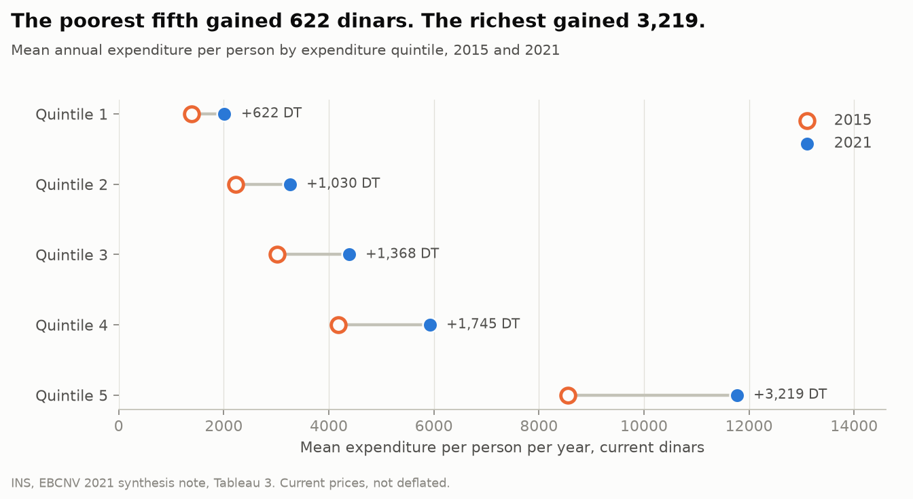
</picture>

Every quintile spent more in 2021 than in 2015. The bottom fifth gained 622 dinars per
person; the top fifth gained 3,219. Current prices, so much of this is inflation — the
point is the spread between the bars, not their length.

### 2. Each region against the national mean, 1990–2021

<picture>
  <source media="(prefers-color-scheme: dark)" srcset="02-regional-gap-dark.png">
  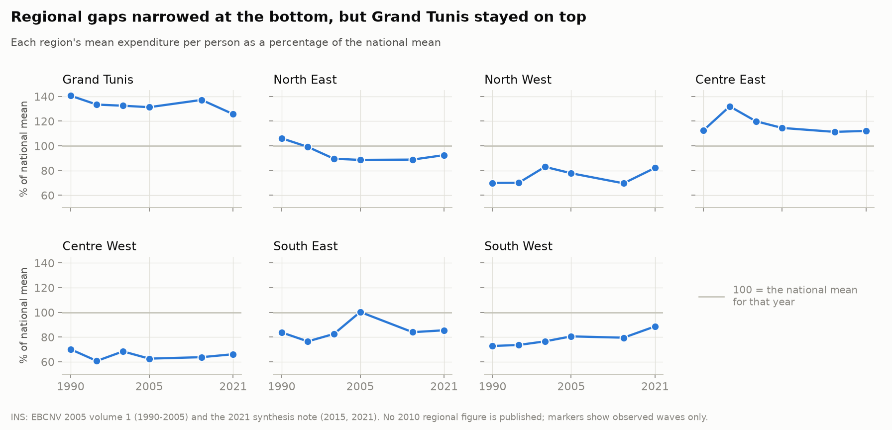
</picture>

Expressing each region as a percentage of the national mean removes inflation entirely,
so a 30-year comparison is meaningful. Grand Tunis fell from 141% to 126% of the national
mean — real convergence at the top. The Centre West went the other way, from 70% to 66%:
the poorest region lost ground relative to the country over three decades.

### 3. Urban and rural, 1990–2021

<picture>
  <source media="(prefers-color-scheme: dark)" srcset="03-urban-rural-dark.png">
  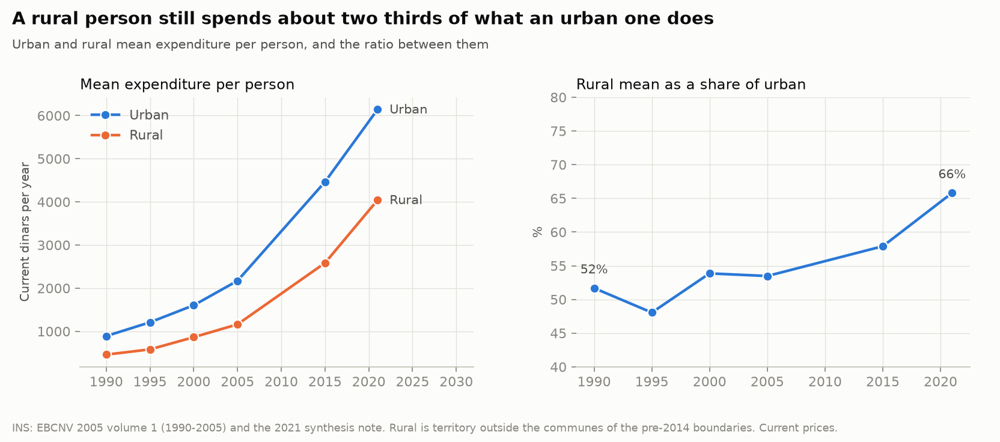
</picture>

The levels diverge in dinars while the ratio slowly closes: a rural person spent 52% of
what an urban one did in 1990 and 66% in 2021. Two panels rather than two y-axes on one
plot, which would have invented a relationship between them.

### 4. Share of spending against share of people

<picture>
  <source media="(prefers-color-scheme: dark)" srcset="04-expenditure-vs-population-share-dark.png">
  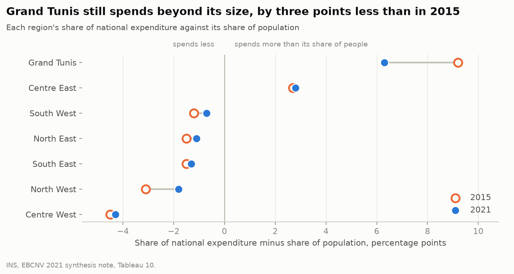
</picture>

The most direct statement of regional inequality available without an index: if a region
holds 12.9% of the people and 8.6% of the spending, that gap is the inequality. Grand
Tunis remains the only large outlier, and its excess fell from +9.2 to +6.3 points.

### 5. Poverty by region, 2005–2021

<picture>
  <source media="(prefers-color-scheme: dark)" srcset="05-poverty-by-region-dark.png">
  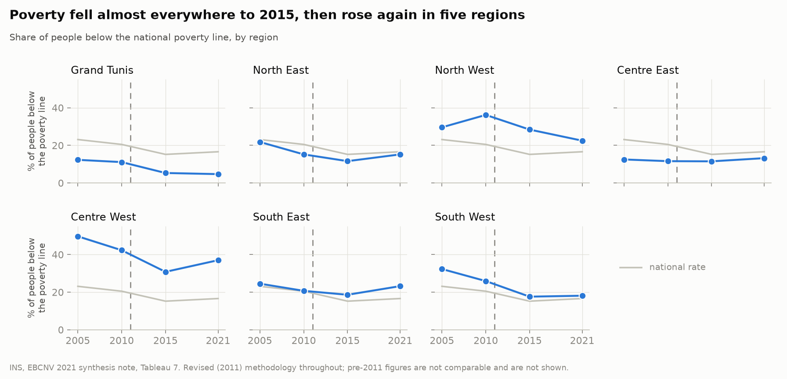
</picture>

Between 2005 and 2015 poverty fell in every region; between 2015 and 2021 it rose again
in five of the seven. Only Grand Tunis and the North West kept improving. The grey line in each panel is the national
rate, on the revised (2011) methodology throughout — pre-2011 figures use a different and
incomparable definition and are deliberately absent. The dashed rule marks January 2011;
figures 13 to 16 pick up what it separates.

### 6. The 2021 distribution

<picture>
  <source media="(prefers-color-scheme: dark)" srcset="06-distribution-2021-dark.png">
  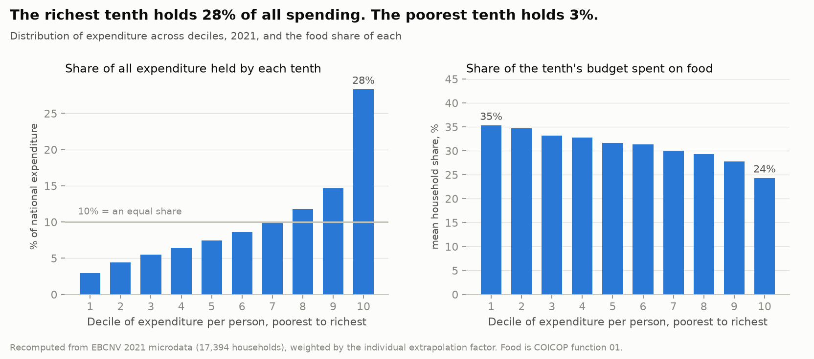
</picture>

Recomputed from the microdata rather than transcribed. The richest tenth accounts for 28%
of all household spending and the poorest tenth for 3%. The right panel is an Engel
curve: the poorest tenth puts 35% of its budget on food, the richest 24%.

A note on that second panel, because the choice changes the answer. It plots the **mean
household food share, weighted by people**. Computed instead as aggregate food spending
over aggregate spending, the two agree to a tenth of a point through decile 9 and then
split — the aggregate ratio puts the top decile at 28.5% and ticks *upward* from decile
9, because a handful of very large budgets dominate the sum. The mean of household shares
is what "how much of its budget does this tenth put on food" actually means, and it falls
monotonically.

---

## Inequality within groups, not between them

The first six figures are built on regional and quintile **means**, which by construction
cannot show how much variation sits inside a group. These six look inside.

### 7. Spread within each region

<picture>
  <source media="(prefers-color-scheme: dark)" srcset="07-within-region-spread-dark.png">
  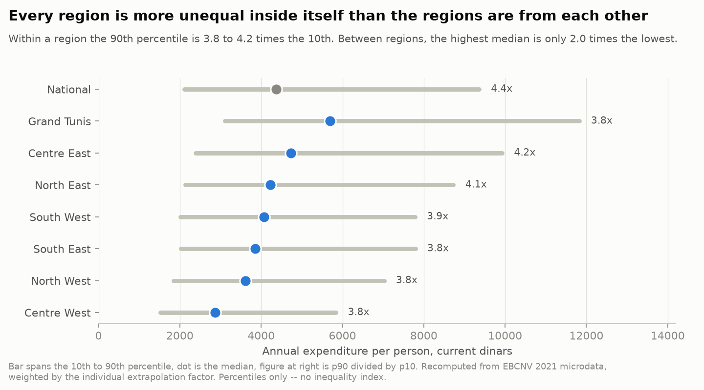
</picture>

The single most consequential figure here. Within every region the 90th percentile of
per-capita expenditure is 3.8 to 4.2 times the 10th. Between regions, the highest median
(Grand Tunis, 5,696 DT) is only 2.0 times the lowest (Centre West, 2,865 DT).

Inequality inside a Tunisian region is about double the inequality between regions. That
reframes figures 2 and 4: regional gaps are real and politically salient, but they are the
smaller part of the dispersion. Percentiles only — no index.

### 8. Dispersion inside governorates

<picture>
  <source media="(prefers-color-scheme: dark)" srcset="08-delegation-dispersion-dark.png">
  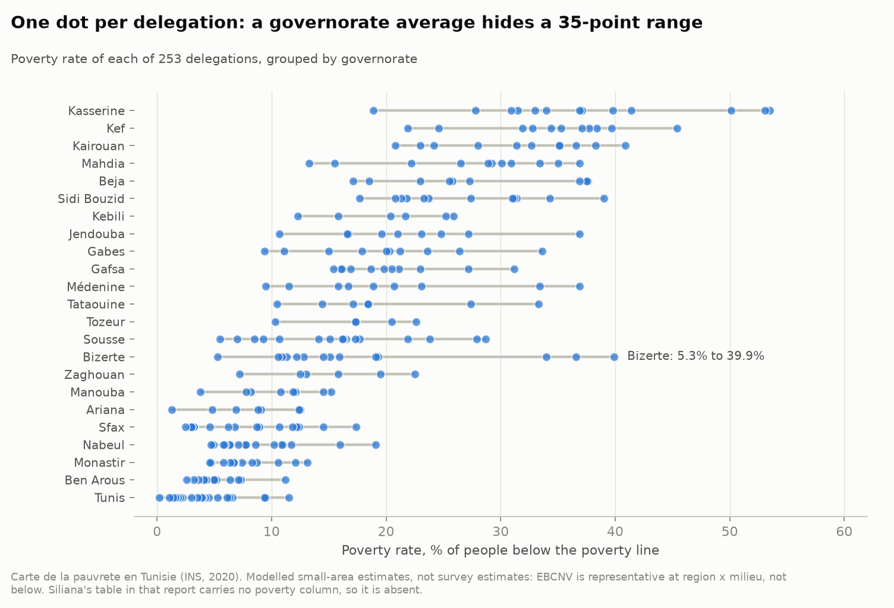
</picture>

The same point one tier down, with one dot per delegation. Bizerte runs from 5.3% to 39.9%
poverty across its delegations — a 34.6-point range inside a single governorate, wider
than the gap between the richest and poorest *regions*. A governorate average describes
almost nobody.

These are modelled small-area estimates from the 2020 poverty map, not survey estimates:
EBCNV is representative at region × milieu and no finer. Siliana is absent because its
table in that report carries no poverty column.

### 9. Who is poor against who the poor are

<picture>
  <source media="(prefers-color-scheme: dark)" srcset="09-incidence-vs-share-of-poor-dark.png">
  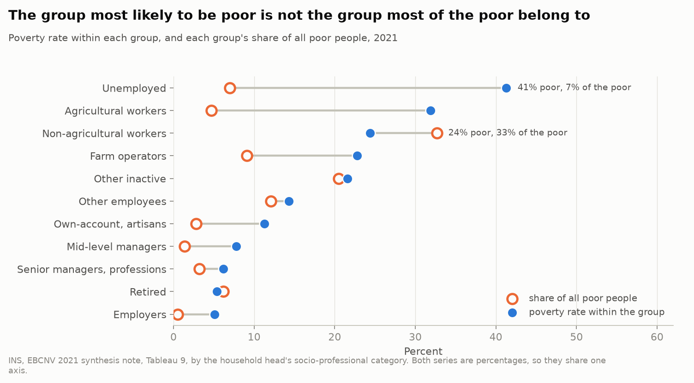
</picture>

Two different questions with two different answers. Households headed by an unemployed
person have the highest poverty rate at 41.3% — but they are only 7.0% of all poor people.
Households headed by a non-agricultural worker have a 24.4% rate and make up 32.7% of the
poor.

Target the highest-risk group and you reach a small slice of poverty; target the largest
group and you spend most of it on the non-poor. This is precisely the distinction a single
index erases, which is much of the argument for not using one.

### 10. Deprivation in kind

<picture>
  <source media="(prefers-color-scheme: dark)" srcset="10-deprivation-in-kind-dark.png">
  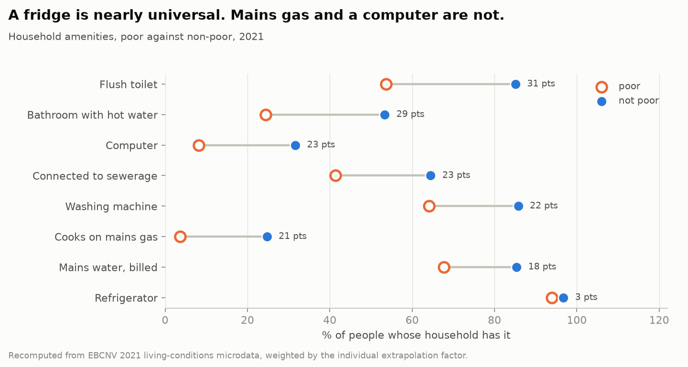
</picture>

Inequality with no dinars in it. A refrigerator is nearly universal — 93.9% of the poor
against 96.8% of the non-poor, a 3-point gap. Mains gas for cooking is not: 3.7% against
24.7%. A computer, 8.2% against 31.6%. A flush toilet, 53.7% against 85.1%.

Which amenities have converged and which have not is a different ranking from expenditure,
and the first use in this repository of the living-conditions file.

### 11. The social protection gap

<picture>
  <source media="(prefers-color-scheme: dark)" srcset="11-social-protection-gap-dark.png">
  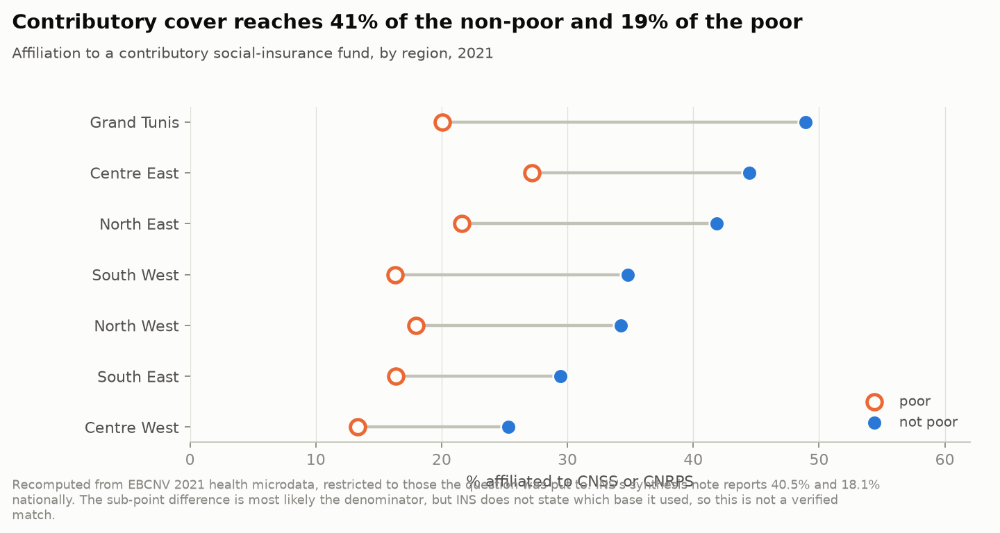
</picture>

Contributory cover reaches 40.8% of the non-poor and 18.5% of the poor — the people with
least capacity to absorb a shock are least likely to be insured against one, in every
region without exception.

INS's synthesis note reports 40.5% and 18.1% nationally. The sub-point difference is most
likely the denominator, but INS does not state which base it used, so this is a close
correspondence rather than a verified match.

### 12. The literacy gap across cohorts

<picture>
  <source media="(prefers-color-scheme: dark)" srcset="12-literacy-gap-dark.png">
  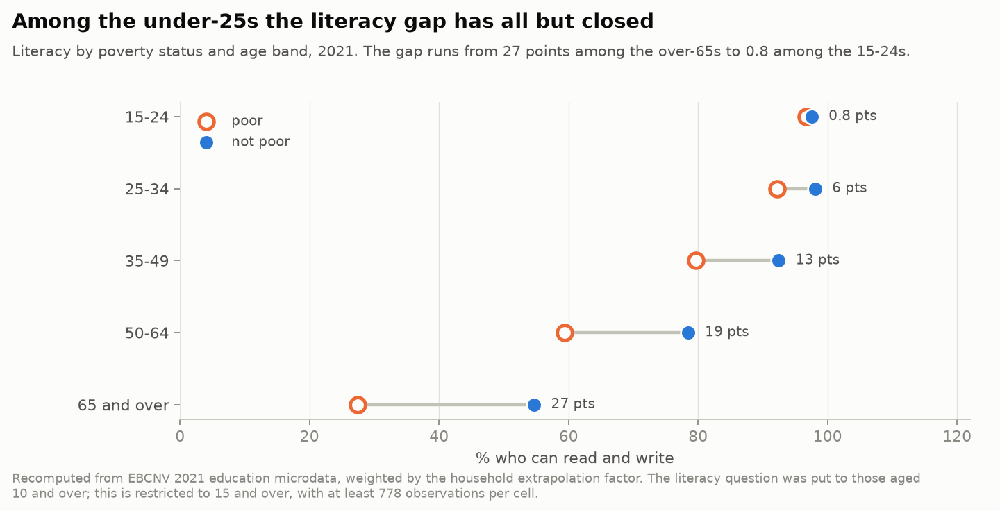
</picture>

Among people aged 65 and over, 54.7% of the non-poor can read and write against 27.4% of
the poor — a 27-point gap. Among 15-to-24-year-olds the same gap is 0.8 points, with both
groups above 96%.

The clearest evolution story in the whole directory, and it comes from a single
cross-section: the cohorts are the time dimension. Whatever else has or has not improved,
mass schooling closed this particular gap almost completely.

The bands are cut from the raw age variable rather than the four-way `age_group`, which is
too coarse to show a gradient. The literacy question was asked of those aged 10 and over,
so the figure is restricted to 15 and over; every cell rests on at least 778 observations.

---

## Across the 2011 revolution

The waves are 2005, 2010, 2015 and 2021 and the revolution is January 2011, so it falls
between two of them: two before, two after. INS applied its revised (2011) poverty
methodology back to 2005 and 2010, which is the only reason a comparison across the break
is possible at all. Every poverty series below is on that revised methodology; the
pre-2011 figures use an incomparable definition and are absent.

**These are before-and-after descriptions, not causal estimates.** There is one country,
no counterfactual and no control group, and the 2010–2021 window holds the revolution and
also the 2015 Bardo and Sousse attacks, the tourism collapse, dinar depreciation, two IMF
programmes and COVID. Nothing here separates those. The figures say "across the
revolution" and never "because of it"; a reader who wants identification should treat this
directory as the wrong instrument.

### 13. National poverty across the revolution, 2005–2021

<picture>
  <source media="(prefers-color-scheme: dark)" srcset="13-poverty-across-the-revolution-dark.png">
  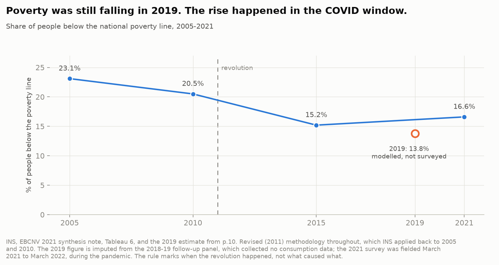
</picture>

23.1% in 2005, 20.5% in 2010, 15.2% in 2015, 16.6% in 2021 — and 13.8% in 2019. That last
point changes the reading. On the four survey waves alone the story is "poverty fell, then
rose after the revolution"; with 2019 in the frame the entire rise sits between 2019 and a
survey fielded March 2021 to March 2022, in the middle of the pandemic.

The 2019 figure is drawn as an open marker because it is modelled, imputed by INS from the
2018–19 follow-up panel, which collected no consumption data. It is not a survey estimate
and should not be read as one. Leaving it out would have been the more misleading choice.

Two things the pre-revolution half of the line settles: poverty was already falling before
2011, by 2.6 points between 2005 and 2010, so a post-2011 decline that starts from the
revolution is reading a trend that was underway. And extreme poverty, on the same source,
went 7.4 → 6.0 → 2.9 → 2.9: it more than halved and then held, including through 2021.

### 14. The regional gap, in ratio and in points

<picture>
  <source media="(prefers-color-scheme: dark)" srcset="14-regional-gap-two-ways-dark.png">
  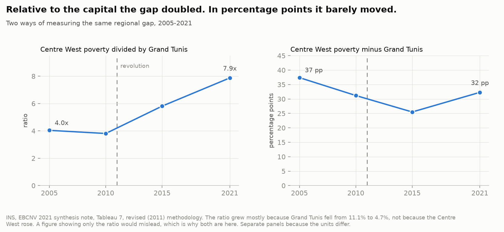
</picture>

Two panels because the two measures disagree, and the disagreement is the finding. The
Centre West against Grand Tunis:

| | 2005 | 2010 | 2015 | 2021 |
|---|---|---|---|---|
| Ratio | 4.0× | 3.8× | 5.8× | **7.9×** |
| Difference | 37.4 pp | 31.2 pp | 25.5 pp | **32.3 pp** |

Relatively the gap roughly doubled. Absolutely it is close to where it stood in 2010. Both
are true of the same two numbers, because the ratio grew mostly through the denominator:
Grand Tunis fell from 11.1% to 4.7% while the Centre West went 42.3% to 37.0%. Publishing
only the ratio would say the gap exploded; only the difference, that little changed.
Neither alone is honest, so both are on the page, on separate axes because the units
differ.

### 15. Urban and rural poverty across the revolution

<picture>
  <source media="(prefers-color-scheme: dark)" srcset="15-urban-rural-poverty-dark.png">
  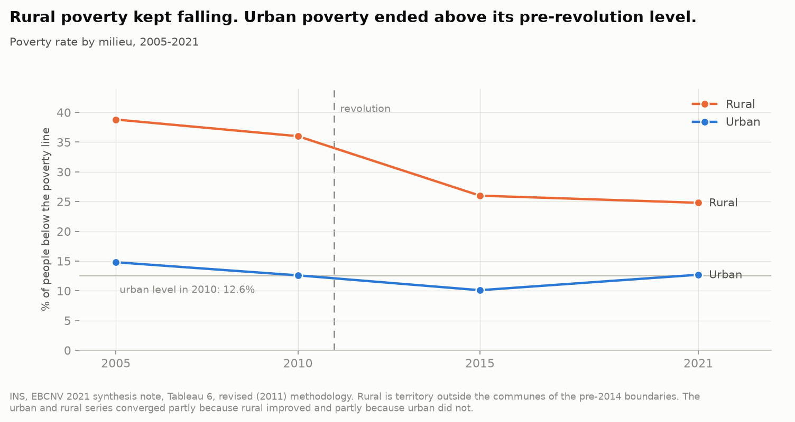
</picture>

Rural poverty fell across the whole period, 38.8% to 24.8%. Urban fell to 2015 and then
went back up: 12.6% in 2010, 10.1% in 2015, 12.7% in 2021 — above where it was the year
before the revolution.

The urban–rural convergence that gets cited is therefore two different movements, and only
one of them is rural improvement. The reference line marks the 2010 urban level so the
crossing is visible rather than asserted.

### 16. What changed in the household budget, 2010 → 2021

<picture>
  <source media="(prefers-color-scheme: dark)" srcset="16-budget-shift-2010-2021-dark.png">
  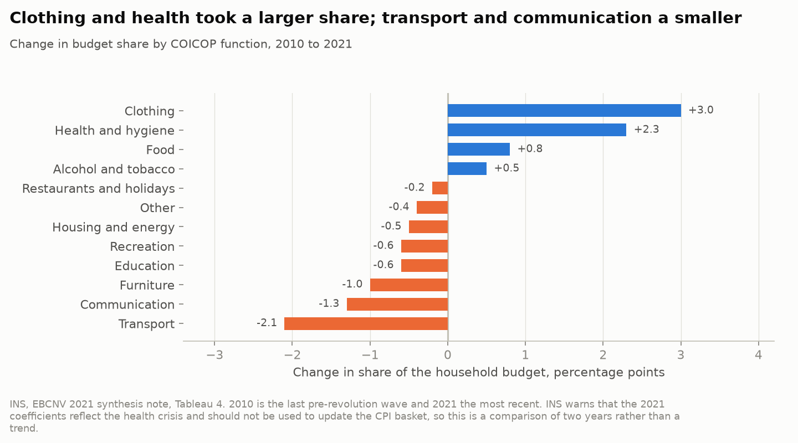
</picture>

The last pre-revolution wave against the most recent one, by COICOP function. Clothing
took 3.0 more points of the budget (8.6% → 11.6%) and health and hygiene 2.3 more
(8.8% → 11.1%); transport gave up 2.1 (9.0% → 6.9%) and communication 1.3 (5.4% → 4.1%).
Food moved least of anything large, 29.3% to 30.1%.

INS warns that the 2021 coefficients reflect the health crisis and are not usable to
update the CPI basket. That warning applies here too: this is a comparison of two years,
one of them abnormal, not a trend.

---

## What the surveys cannot show on their own

EBCNV runs every five or six years and measures households. Three things that matter for
reading it come from a different INS publication entirely — the *Annuaire Statistique de
la Tunisie*, whose 2001–2023 editions carry annual series on prices and on work.

Bringing in a second source has a cost worth stating: these are national aggregates, not
survey microdata, and nothing here can be broken down by household. They are context for
the survey figures, not extensions of them.

### 17. Prices since 1999

<picture>
  <source media="(prefers-color-scheme: dark)" srcset="17-prices-since-1999-dark.png">
  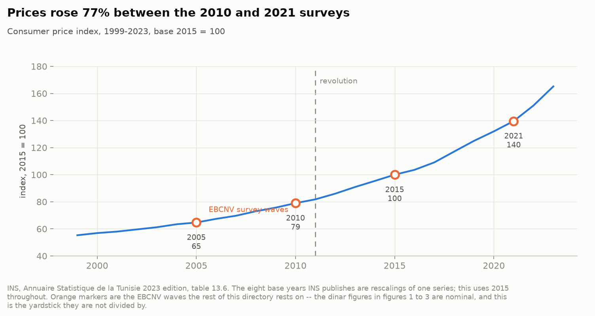
</picture>

The index stands at 64.7 in 2005, 79.0 in 2010, 100.0 in 2015 and 139.6 in 2021. Between
the last pre-revolution survey and the most recent one, prices rose 77%.

This is the yardstick figures 1 to 3 are **not** divided by. Those show expenditure in
nominal dinars, because that is what INS publishes and what the microdata contains. A
reader who takes the rise in mean per-capita expenditure between two waves as a gain in
living standards is reading this line into it without knowing.

INS publishes the same series on eight base years side by side. They are rescalings of
one series, not eight measurements, and this uses 2015 throughout.

### 18. What rose in price against what rose in the budget

<picture>
  <source media="(prefers-color-scheme: dark)" srcset="18-price-against-budget-dark.png">
  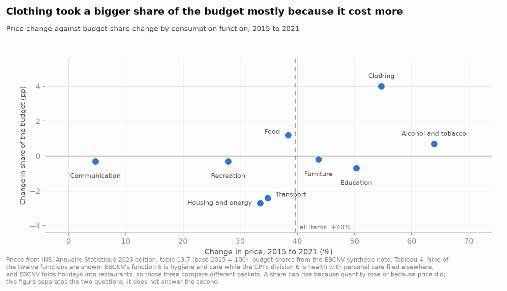
</picture>

Both endpoints are survey waves, so the two axes cover exactly the same span. Clothing
rose 54.7% in price and took 4.0 more points of the budget — the largest share rise in
figure 16, and mostly a price story rather than households buying more clothes.
Communication is the opposite corner: prices essentially flat at +4.7%, share down 0.3
points. Housing and energy rose 33.5%, below the 39.6% all-items rate, and still lost 2.7
points of the budget.

**A share can rise because quantity rose or because price did.** This figure separates
the two questions; it does not answer the second. Nothing here identifies a demand
response, and the same picture is consistent with several stories about what households
did.

Nine of the twelve functions are shown. EBCNV's function 6 is "hygiene and care" while
the CPI's division 6 is health with personal care filed under division 12, and EBCNV
folds holidays in with restaurants — so three of the twelve would compare different
baskets, and are left out rather than quietly plotted.

### 19. Unemployment by education since the revolution

<picture>
  <source media="(prefers-color-scheme: dark)" srcset="19-unemployment-by-education-dark.png">
  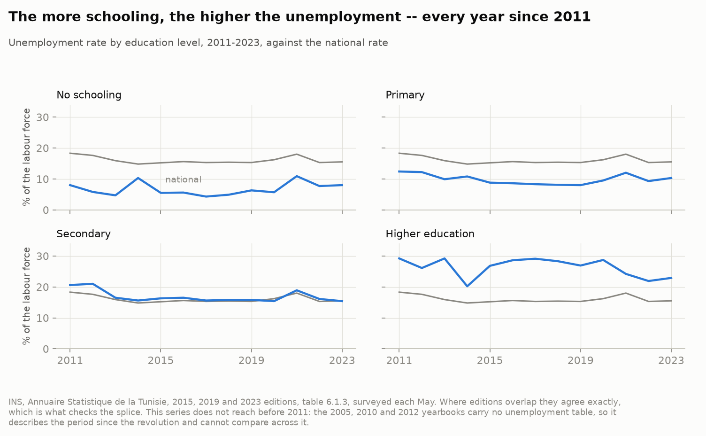
</picture>

In every one of the thirteen years, unemployment rises with education. People with no
schooling run between 4.3% and 10.9%; people with higher education between 20.2% and
29.2%, above the national rate throughout. The gradient never once inverts, which a test
asserts rather than leaving to the eye.

Read this against figure 12, where mass schooling has almost closed the literacy gap
between poor and non-poor among the young. Both can be true: education has been
distributed far more widely, and it does not lead where it is supposed to.

**This series does not span the revolution.** The 2005, 2010 and 2012 yearbooks carry no
unemployment table — checked in the documents, not assumed — so 2011 is the earliest year
available. It describes the period since, and cannot compare across.

---

## Inequality without dinars

Seven figures from the parts of EBCNV 2021 no earlier figure touched: the health,
education and labour modules, and the 3.26-million-row product file.

### 20. What households pay out of pocket for care

<picture>
  <source media="(prefers-color-scheme: dark)" srcset="20-out-of-pocket-health-dark.png">
  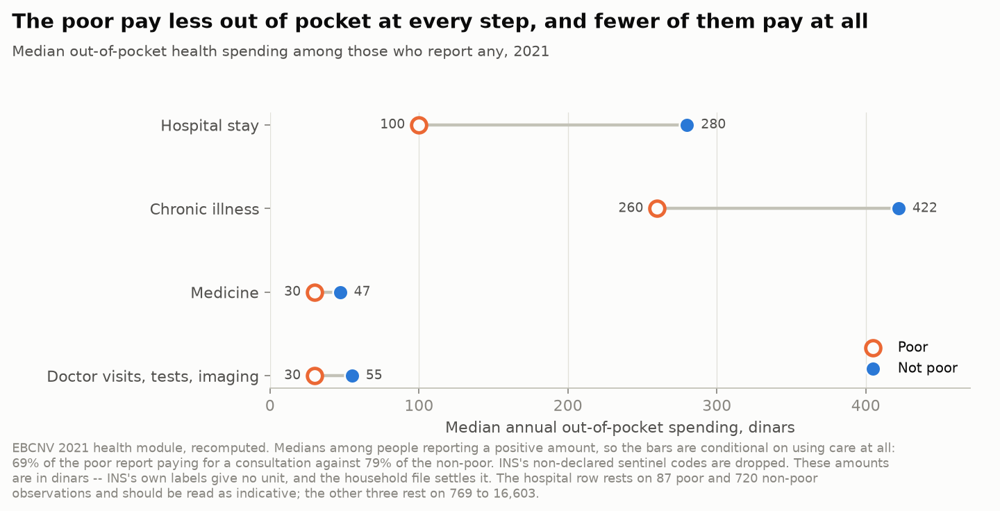
</picture>

Among people who report paying anything: 30 DT against 55 for doctor visits, tests and
imaging; 30 against 47 for medicine; 260 against 422 for a chronic illness; 100 against
280 for a hospital stay. Fewer of the poor pay at all — 69% report a consultation cost
against 79%.

Spending less on health is not the same as needing less of it, and the conditional
medians make that visible: the gap is in both who pays and how much.

The hospital row rests on 87 poor observations against 720 non-poor and is indicative;
the other three rest on between 769 and 16,603. INS's non-declared sentinel codes are
dropped throughout — they survive in the processed file as 999 and 999999 and would wreck
any average that kept them.

These amounts are in **dinars**. INS's own variable labels give no unit, and an earlier
version of this repository's codebook guessed millimes — which would make a doctor's
visit cost four santimes. Summed per household, the module comes to a median 172 against
1,749 for COICOP function 6, about 8%, which is what out-of-pocket medical care should be
inside a category that also holds hygiene and personal care. On the millimes reading it
would be 0.01%.

### 21. Chronic illness and who holds a card

<picture>
  <source media="(prefers-color-scheme: dark)" srcset="21-chronic-illness-and-cover-dark.png">
  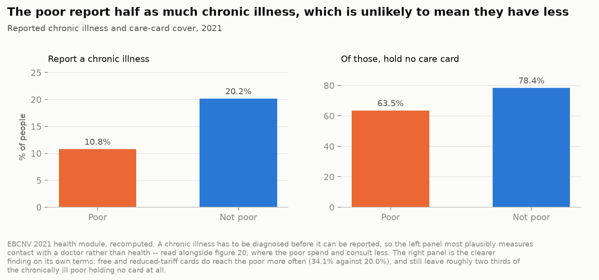
</picture>

10.8% of the poor report a chronic illness against 20.2% of the non-poor.

The obvious reading — that the poor are healthier — is almost certainly wrong. A chronic
illness has to be diagnosed before it can be reported, and figure 20 shows the poor
consulting and paying less. The left panel most plausibly measures contact with a doctor.
It is included **because** it is a trap: a naive reading of a real INS variable produces
a conclusion that inverts the truth.

The right panel is the firmer finding. Free and reduced-tariff cards do reach the poor
more often, 34.1% against 20.0% — the targeting works in the direction intended — and
still leave roughly two thirds of the chronically ill poor holding no card at all.

### 22. Why people left school

<picture>
  <source media="(prefers-color-scheme: dark)" srcset="22-why-people-left-school-dark.png">
  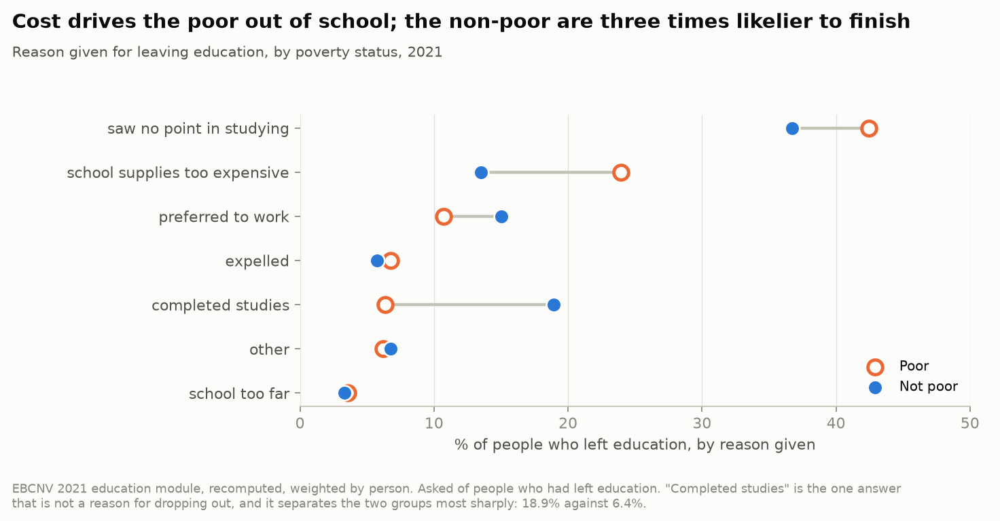
</picture>

"School supplies too expensive" is given by 23.9% of the poor and 13.5% of the non-poor.
The sharpest split is the answer that is not a reason for dropping out at all: 18.9% of
the non-poor left because they had **completed** their studies, against 6.4% of the poor —
three times.

"Saw no point in studying" is the most common answer in both groups, 42.4% and 36.7%.
Figure 19 is worth holding alongside it: for a Tunisian graduate, unemployment has run
above 20% every year since 2011.

### 23. How far school is

<picture>
  <source media="(prefers-color-scheme: dark)" srcset="23-distance-to-school-dark.png">
  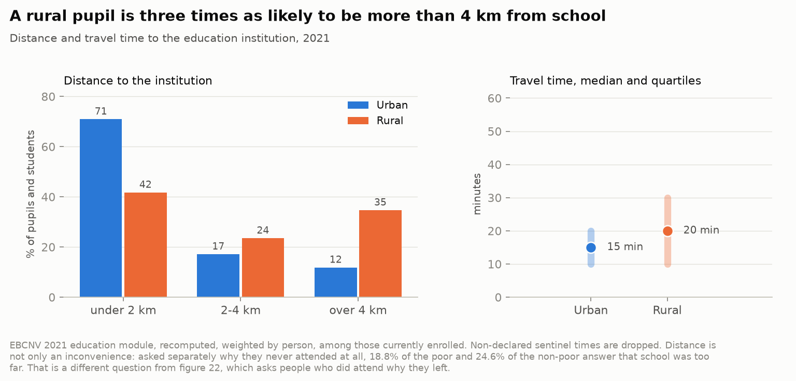
</picture>

35% of rural pupils are more than 4 km from their institution against 12% of urban ones,
close to three times. The median rural journey is 20 minutes against 15, and the upper
quartile 30 against 20.

Asked separately why they never attended school at all, 18.8% of the poor and 24.6% of
the non-poor answer that it was too far — a different question from figure 22, which asks
people who did attend why they stopped.

### 24. Why people are not working

<picture>
  <source media="(prefers-color-scheme: dark)" srcset="24-why-people-are-not-working-dark.png">
  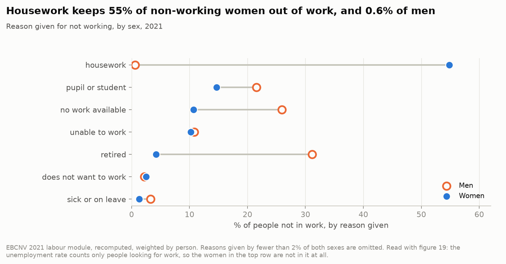
</picture>

Housework accounts for 54.8% of non-working women and 0.6% of non-working men. Nothing
else in this directory separates two groups so completely.

The mirror image is retirement: 31.2% of non-working men against 4.2% of women — itself a
consequence of the first, since a lifetime of unpaid housework produces no pension. And
"no work available" is given by 25.9% of men against 10.7% of women.

Read with figure 19: the unemployment rate counts only people looking for work, so the
women in the top row are not in it at all. A falling unemployment rate and a wall of
women outside the labour force are perfectly compatible.

### 25. Where working people work

<picture>
  <source media="(prefers-color-scheme: dark)" srcset="25-where-the-poor-work-dark.png">
  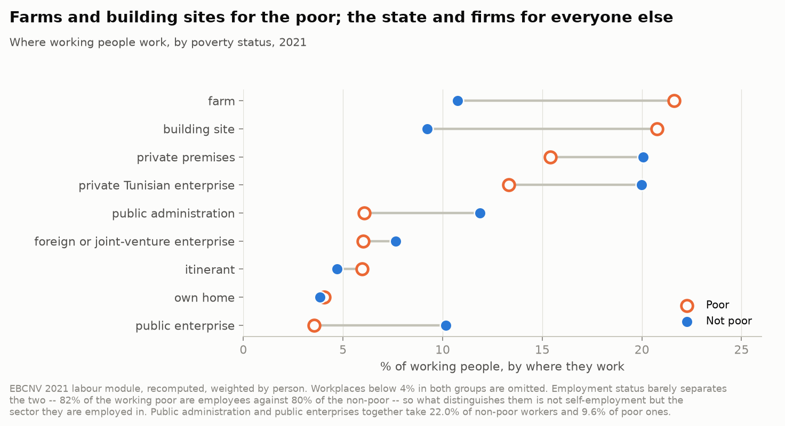
</picture>

What does *not* separate the two groups: employment status. 82.4% of working poor people
are employees, against 79.8% of the non-poor. The poor are not disproportionately
self-employed or informal by that measure.

What does: the sector. Farms take 21.6% of poor workers against 10.7%, building sites
20.8% against 9.2%. Public administration and public enterprises together take 22.0% of
non-poor workers and 9.6% of poor ones.

A public-sector job is the clearest single marker of not being poor in this data, which is
worth sitting with given how much of Tunisian politics since 2011 has turned on public
employment.

### 26. Where household money goes

<picture>
  <source media="(prefers-color-scheme: dark)" srcset="26-where-household-money-goes-dark.png">
  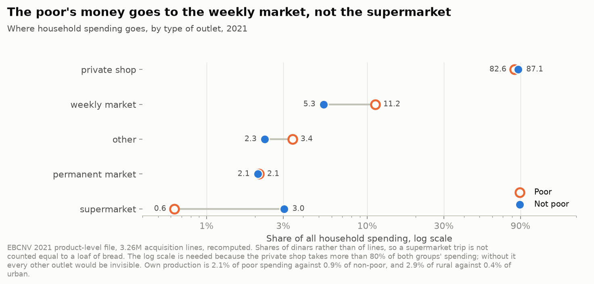
</picture>

The first use of the product-level file: 3.26 million acquisition lines, one per household
per item. Shares of **dinars**, not of lines, so a supermarket trip is not counted equal
to a loaf of bread.

The weekly market takes 11.2% of poor spending against 5.3% of non-poor. Supermarkets
take 0.6% against 3.0% — five times. The private shop dominates both at 82.6% and 87.1%,
which is why the axis is logarithmic; on a linear scale every other outlet would be a
sliver.

Own production is 2.1% of poor spending against 0.9%, and 2.9% of rural against 0.4% of
urban — small everywhere, and one of the few places where being rural shows up as
something other than a disadvantage.

---

## Can the revolution's effect be identified?

The four figures above this line describe what happened across January 2011. These four
ask the harder question — whether any of it can be *attributed* to the revolution — and
answer no, by running the tests rather than asserting the conclusion.

**Why the answer is structural.** The revolution treated all twenty-four governorates at
the same instant. There is no untreated unit inside Tunisia, and no comparison country in
this data to build a synthetic one from. That leaves two candidate designs: an interrupted
time series, whose counterfactual is an extrapolated pre-trend, and a
difference-in-differences on differential exposure, which requires the compared groups to
have been on parallel paths beforehand. Figures 28 and 29 test exactly those two
requirements. Both fail.

The outcome throughout is **pupils per teacher in the first cycle of basic education**,
across 23 governorates and 21 years (1998–2018), 481 of 483 cells present. It needs no
population denominator — both halves come from the same chapter and the same years — and
it measures something governments actually allocate.

### 27. The counterfactual is an assumption

<picture>
  <source media="(prefers-color-scheme: dark)" srcset="27-counterfactual-is-an-assumption-dark.png">
  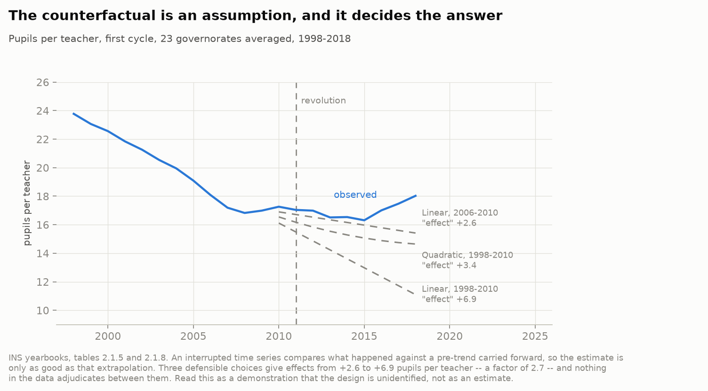
</picture>

An interrupted time series compares what happened against the pre-trend carried forward,
so the estimate is only ever as good as that extrapolation. Three defensible choices —
linear on 1998–2010, quadratic on the same window, linear on 2006–2010 — give "effects"
of **+6.9, +3.4 and +2.6** pupils per teacher. A factor of 2.7 between them, and nothing
in the data adjudicates.

The national series itself is not ambiguous: 23.8 pupils per teacher in 1998, falling to
16.8 by 2008, then flat and rising to 18.0 by 2018. Something changed. What the design
cannot say is *when*, or *because of what*.

### 28. Every candidate break year gives the same answer

<picture>
  <source media="(prefers-color-scheme: dark)" srcset="28-placebo-break-years-dark.png">
  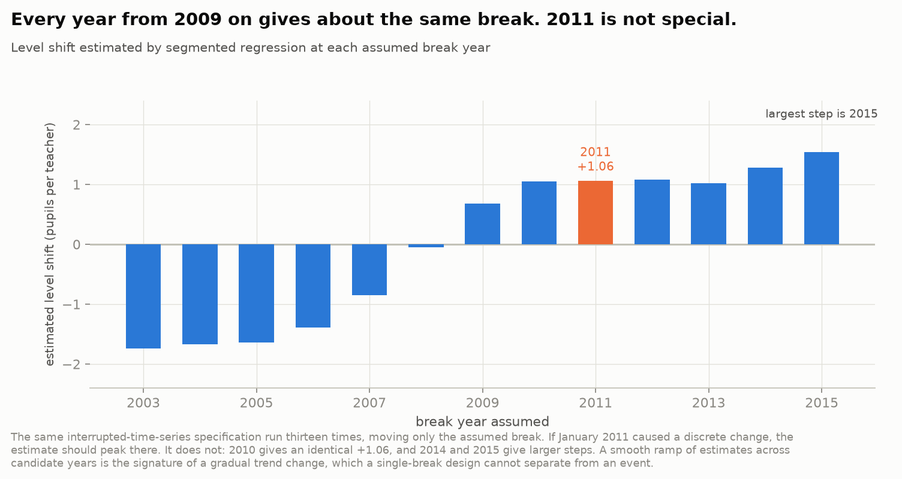
</picture>

The falsification test. The same segmented regression is run thirteen times, moving only
the year the break is assumed to occur. If January 2011 caused a discrete change, the
estimated step should peak there.

It does not. 2010 gives **+1.05**, 2011 gives **+1.06**, 2012 gives **+1.08** — and 2014
and 2015 give larger steps still, at +1.28 and +1.54. The estimates form a smooth ramp
across candidate years, which is the signature of a gradual change in trend, not of an
event. A single-break design cannot separate the two, and this figure is how you find
that out rather than assuming it away.

### 29. Parallel trends fail, and fail badly

<picture>
  <source media="(prefers-color-scheme: dark)" srcset="29-parallel-trends-fail-dark.png">
  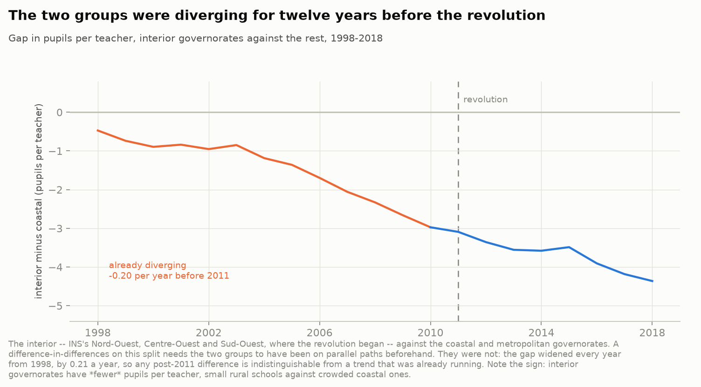
</picture>

The natural difference-in-differences here splits governorates by exposure: the interior —
INS's Nord-Ouest, Centre-Ouest and Sud-Ouest, where the revolution began and where the
grievance was concentrated — against the coastal and metropolitan governorates.

That design needs the two groups to have been moving in parallel before 2011. They were
not. The gap widened **every year from 1998**, at 0.21 pupils per teacher a year, going
from −0.45 in 1998 to −3.17 by 2010 and on to −4.56 by 2018. A post-2011 difference is
indistinguishable from a trend that had been running for twelve years.

Note the sign, which is easy to misread: interior governorates have *fewer* pupils per
teacher — small rural schools against crowded coastal ones. On this measure the interior
looks better served, and still diverging.

### 30. What the data does support

<picture>
  <source media="(prefers-color-scheme: dark)" srcset="30-regional-dispersion-dark.png">
  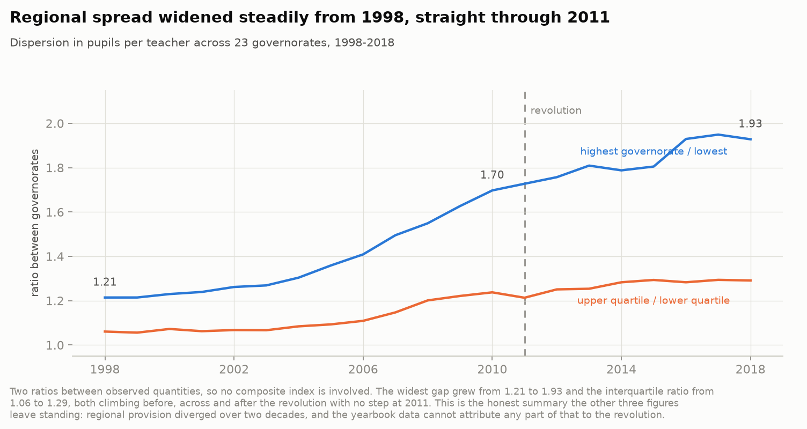
</picture>

Description, and it is worth having. The ratio between the highest and lowest governorate
went from **1.21 in 1998 to 1.70 in 2010 to 1.93 in 2018**; the interquartile ratio from
1.06 to 1.29. Both climb before, across and after the revolution, with no step at 2011.

Two ratios between observed quantities, so the no-composite-index rule holds here as
everywhere else in this directory.

This is the honest summary the other three leave standing: regional provision diverged
steadily over two decades, and nothing in the yearbook data can attribute any part of that
divergence to the revolution. That is a finding about the limits of the evidence, not a
claim that the revolution had no effect — those are different statements, and only the
first is supported.

---

## Colour

The palette is the dataviz reference instance: blue `#2a78d6` and orange `#eb6834` on
light, blue `#3987e5` and orange `#d95926` on dark. Both pairs were checked with the
skill's `validate_palette.js` and pass every gate in both modes — worst-adjacent
colour-vision-deficiency ΔE 24.7 light and 26.8 dark, against a threshold of 8. No figure
uses more than two categorical series; where more than two groups appear they are small
multiples with one series per panel, so colour never has to carry seven identities at
once.

## Sources

Figures 1–5, 9 and 13–16 come from `tn_consumption_panel.csv`, on the `published` basis
throughout — figures transcribed from INS documents, each row carrying its source table.
Figure 8 comes from the 2020 poverty map. Figures 17 and 19 come from the INS statistical
yearbooks, and figure 18 sets one of those against the panel. Figures 6, 7, 10, 11, 12 and
20–26 are recomputed from the EBCNV 2021 microdata. Figures 27–30 come from the statistical yearbooks'
governorate panel. Every claim above is reproducible from `scripts/make_figures.py`, and
the numbers quoted here were recomputed from the data before being written rather than
read off the charts.
